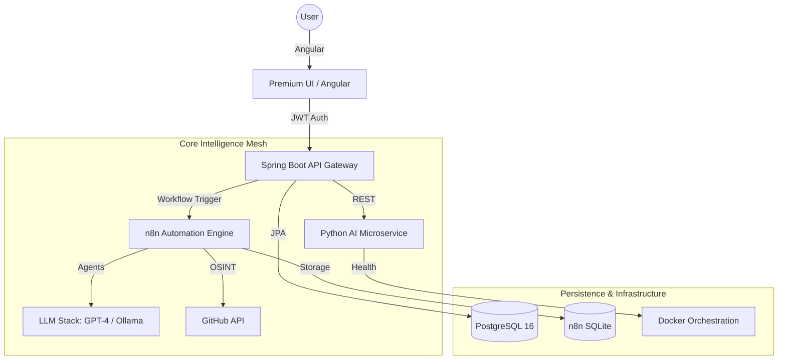

# 🌌 TalentPredict

### *Empowering Human Capital through Intelligent Predictive Analytics*

TalentPredict is an enterprise-grade AI ecosystem designed to bridge the gap between human potential and organizational needs. By leveraging a multi-agent AI architecture, the platform transforms raw talent data into actionable career trajectories, providing a seamless "A to Z" journey for both candidates and talent managers.

---

## 🧭 The "A to Z" Journey

TalentPredict handles the entire talent lifecycle through a structured four-stage process:

### 1. 📥 Onboarding & Extraction (The "A")
*   **Intelligent CV Parsing**: Candidates upload their resumes. Our proprietary Python-based CV engine extracts text, skills, and experience locally to preserve privacy before structuring it for AI analysis.
*   **Personality Profiling**: Users undergo behavioral assessments (PCM, MBTI models) to capture soft skill markers and cultural fit indicators.

### 2. 🧠 Cognitive Analysis
*   **Multi-Agent Orchestration**: Data is passed to **n8n**, where a specialized agentic workflow combines CV data with personality results.
*   **Global Context Integration**: The AI agents lookup GitHub repositories and professional footprints to validate technical proficiency and coding patterns.

### 3. 🎯 Predictive Modeling
*   **Skill Gap Mapping**: The system identifies the "delta" between current capabilities and the requirements of future roles.
*   **Learning Path Generation**: Using high-performance LLMs (Ollama/OpenRouter), the platform predicts the most efficient training modules to close those gaps.

### 4. 🚀 Career Acceleration (The "Z")
*   **Interactive Dashboards**: Stakeholders receive a 360° view of talent readiness.
*   **HR Integration**: Automated ticket generation for training approvals and direct integration with recruitment pipelines.

---

## 🏗️ Enterprise Architecture

TalentPredict is built on a **High-Availability Microservices Mesh**:

---

## 🛠️ Technical Excellence

### 💻 Frontend (The Experience)
Built with **Angular** and **PrimeNG**, our frontend focuses on "Data Visualization First" principles, providing complex analytics in a beautiful, responsive, and intuitive interface.

### ⚙️ Backend (The Engine)
Our **Spring Boot** core implements rigorous security standards via **JWT** and **Spring Security**, ensuring that sensitive personal data is protected at every layer of the transaction.

### 🤖 AI Service (The Brain)
A dedicated **FastAPI** microservice utilizing **LangChain** and **Asynchronous Processing** to handle heavy computational tasks like PDF parsing and agentic reasoning without blocking the main application flow.

### 🔗 Orchestration (The Glue)
**n8n** acts as our low-code orchestration layer, allowing HR teams and developers to modify complex AI workflows (like fraud detection or social lookups) without changing core application code.

---

## 📁 Repository Organization

To maintain high developer velocity, the project is strictly organized:

*   📂 `BackEnd/`: Spring Boot high-performance API.
*   📂 `FrontEnd/`: Premium Angular client application.
*   📂 `talentpredict-ai/`: Python-based AI agents & parsing engines.
*   📂 `n8n/`: Workflow definitions and custom logic.
*   📂 `scripts/`: Automated management and DB initialization.
*   📂 `docs/`: Comprehensive technical guides (Architecture, API, Startup).

---

## ⚡ Quick Start

Experience the power of TalentPredict in minutes:

1.  **Environment Setup**: Rename `.env.example` to `.env` and configure your LLM providers.
2.  **Deployment**: Execute `docker-compose up -d` to launch the core infrastructure.
3.  **Bootstrap**: Use `scripts/db/init-databases.sql` to prepare your environment.

Detailed instructions can be found in our **[Project Startup Guide](./docs/STARTUP.md)**.

---

## 🤝 Support & Contribution

TalentPredict is built on the principles of modularity and collaboration. For technical support, please refer to the **[Architecture Documentation](./docs/ARCHITECTURE.md)**.

---

© 2024 **TalentPredict Platform**. *Intelligence at the service of Talent.*
