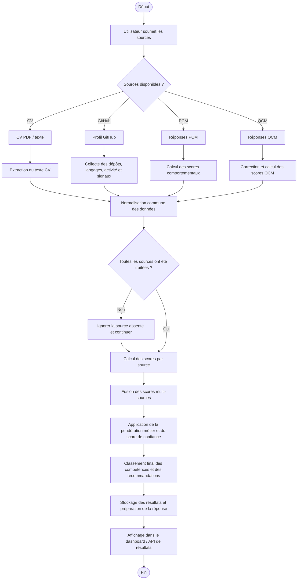

# Diagramme d'activité du pipeline multi-source

Ce diagramme décrit le flux global de TalentPredict pour l'analyse d'un candidat à partir de plusieurs sources: CV, GitHub, PCM et QCM. Le pipeline collecte, normalise, score puis fusionne les signaux avant de produire un résultat consolidé.

## Lecture du flux

1. Le candidat ou le système lance l'analyse avec les sources disponibles.
2. Le CV est d'abord extrait et normalisé afin d'obtenir du texte exploitable.
3. GitHub est analysé pour détecter les langages, la régularité des contributions et les signaux techniques.
4. Le PCM fournit un score comportemental centré sur les soft skills.
5. Le QCM apporte une mesure complémentaire plus structurée et comparable.
6. Chaque source produit ses propres scores, puis le moteur de fusion combine ces résultats dans un score global.
7. Le système calcule ensuite un score de confiance, un classement des compétences et les résultats finaux.
8. Les résultats sont persistés puis exposés à l'interface de consultation.

## Résultat attendu

Le pipeline produit généralement:

- un score global du candidat;
- un détail par source;
- un classement des compétences fortes et des points faibles;
- des recommandations ou une synthèse finale pour l'utilisateur.

## Remarque

Le pipeline reste tolérant aux sources manquantes: si CV, GitHub, PCM ou QCM n'est pas disponible, l'analyse continue avec les signaux restants.